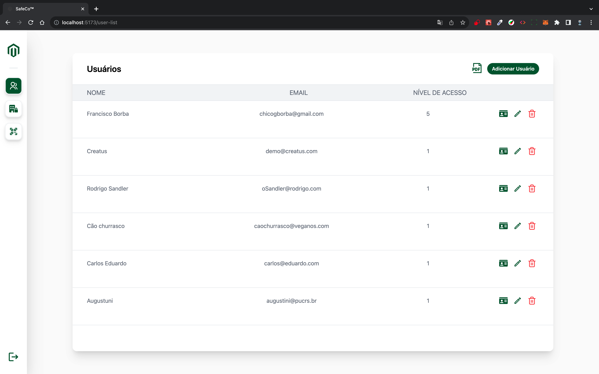
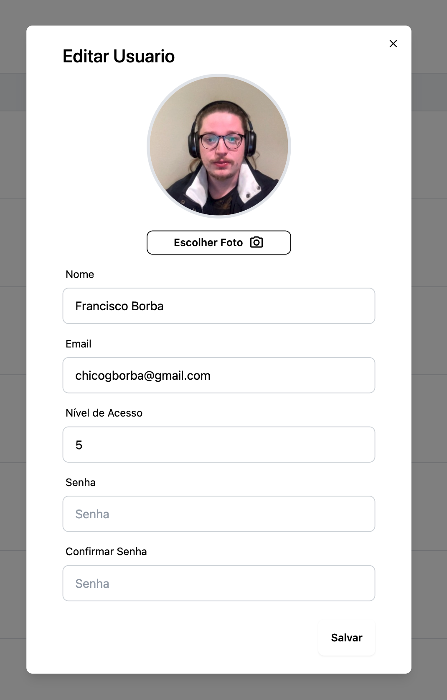
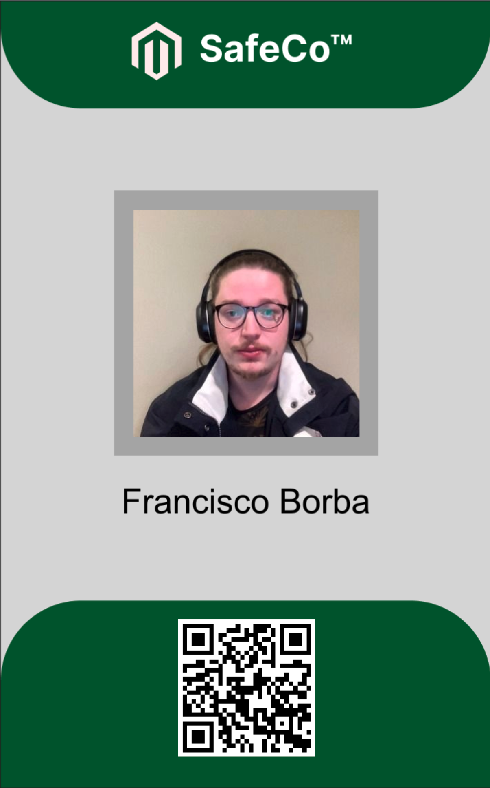
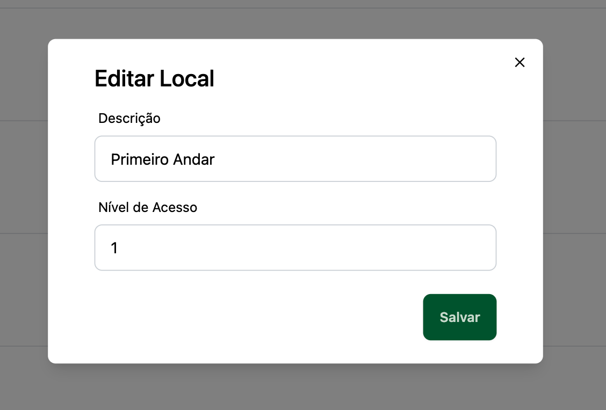
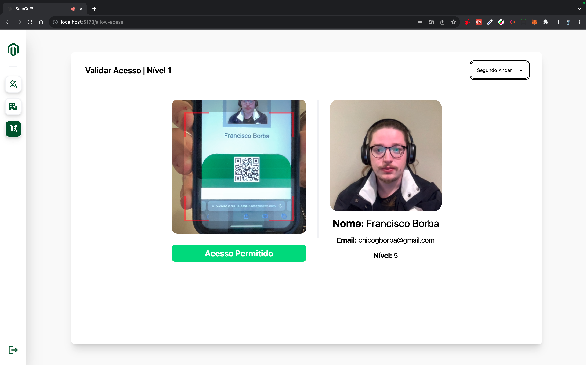
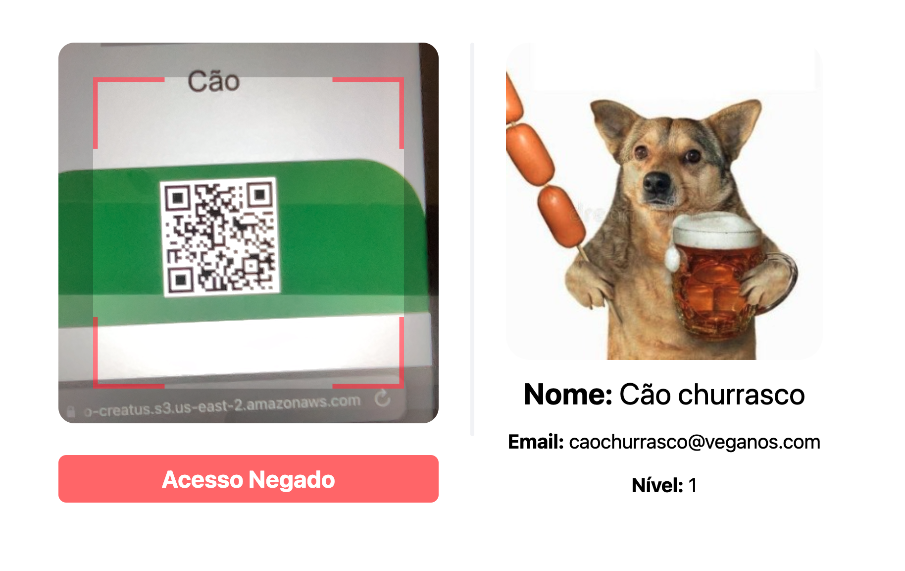

# SafeCo™ - Guarita Inteligente

## 📜 Sobre o Projeto

Bom, em primeiro lugar, gostaria de agradecer pelo tempo dedicado à análise deste desafio e a análise da minha candidatura neste processo seletivo. Dito isso, acabei me empolgando com a ideia do projeto e adicionei bem mais do que a proposta inicial. Algumas das features que incluí levaram à construção de um backend próprio, e todas essas ideias surgiram da base do desafio de backend e frontend.

Dito isso, vamos começar pelas motivações por trás dessas adições. Considerando que a Creatus oferece serviços de Venture Builder e CTO as a Service, resolvi me basear nessa vertente mais empreendedora e nisso criar uma empresa fictícia chamada SafeCo™, seguindo a temática de níveis de acesso. A ideia da empresa é oferecer um SaaS voltado para segurança e controle de acesso de pessoas, gerando relatórios detalhados que acompanham o trajeto de uma pessoa pelos pontos de controle de uma determinada empresa.

Infelizmente, como o prazo para finalizar o projeto era de apenas uma semana, reduzi o escopo para tentar atender ao menos a um modelo de MVP capaz de realizar as funções de uma guarita inteligente. Para isso, criei várias páginas, que vou explicar a seguir:

## 🚀 Funcionalidades

### 0. Tela de login

Uma tela de login simples, que utiliza atenticação JWT para acessar as páginas internas.
Além disso foi feita uma animação com as ondas do design original


### 1. Listagem de Usuários

Esta página permite visualizar todos os usuários da plataforma e gerar relatórios PDF com suas informações, incluindo e-mails e níveis de acesso. Fotos de perfil são usadas para criar crachás dinâmicos com QR Codes.





### 2. Listagem de Locais

Permite a criação e edição de locais, com descrição e nível de acesso necessário para entrada.





### 3. Validar Acesso

Usa a webcam para ler o QR Code do crachá em tempo real e verificar o acesso do usuário ao local selecionado. Mostra a foto, nome e e-mail do usuário para evitar fraudes.




## 🛠️ Como Rodar

### Frontend

1. Instale as dependências:
   ```bash
   npm install
   ```

2. Execute o servidor de desenvolvimento:
   ```bash
   npm run dev
   ```

### Backend

1. Instale as dependências:
   ```bash
   npm install
   ```

2. Gere o cliente Prisma:
   ```bash
   npx prisma generate
   ```

3. Inicie o servidor:
   ```bash
   npx ts-node index.ts
   ```

## 🔐 Dados Sensíveis

Para garantir que o programa funcione, o arquivo `.env` foi criptografado e colocado na pasta `src` como `dotenv.txt`. Use o site [Invertexto](https://www.invertexto.com/texto-criptografado) com a senha "boloruim" para acessar os dados da `.env` original. Pretendo remover esses dados após o processo seletivo.

## 📞 Contato

Se precisar de mais alguma coisa, basta me chamar no WhatsApp.

## 📝 Informações de login inicial

email: demo@creatus.com
senha: Creatus